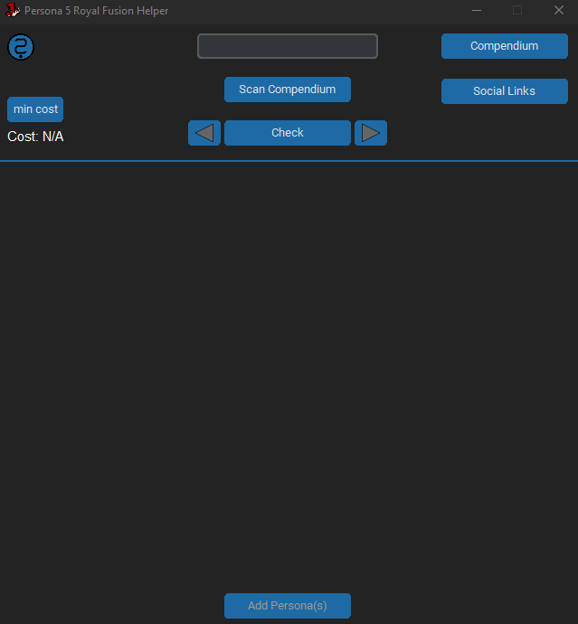
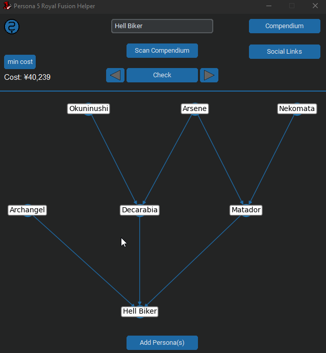
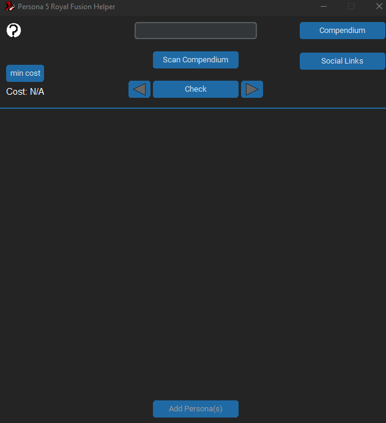

# Persona 5 Royal Fusion Helper

## Scanning the compendium
At this point in time this feature will only work with 1080p monitors. 
Scanning takes screenshots of your Compendium and utilizes Tesseract OCR to determine the name, price and current level of all owned Personas. The number recognition can be a bit faulty in rare cases but to mitigate this all scanned levels which are lower than the Persona's base level will be ignored.
Pressing ESC during the scan will abort it.

## Graph
### Fusion search
By typing in the name of a Persona you will already get button suggestions which will autocomplete the name. The text on those buttons are white, red or green which indicates that you can fuse the Persona (white), can not fuse the Persona (red) or already own it (green). Afterwards a graph will show up by clicking on "Check".

### Persona info
Left-clicking on any Node will open a pop-up which will show the name, base level, current level, arcane and price of the selected Persona. Clicking anywhere outside the popup will close it.

### Changing fusion recipe
Right-clicking on any node will highlight it red. The recipe for the selected Persona can be changed be using the arrow-buttons next to "Check" and the graph will change accordingly. If the arrows remain disabled it means there no more recipes available.

### Add Persona(s)
To avoid the need to scan the Compendium again or open the Compendium window and manually add Personas every time you do any fusion recipe you can instead use the "Add Persona(s)"-button. It will add all not owned Personas from the currently shown tree to your Compendium. 

## Price calculation and treasure demon fusions
Both of these features aren't static like regular Persona fusions due to both of them being dependent on the Personas current level. Therefor those can only reliably be determined by using the "Scan Compendium" function which will scan the current level and current price of each Persona as well. If a Persona is added manually via the Compendium menu or the "Add Persona(s)"-Button they will have their base level as their current level and ¥0 as their price. 
 
### Min price calculation
This button will compare the cost all of all possible combinations that result the currently shown Persona. Be aware that depending on the amount of possible combinations it can take a long time and result in the application not responding.

NOTE: This tool does NOT actually calculate ALL possible recipes for every Persona. It stops after the first set of possible combinations to avoid potential loops in the graph.

## Social Links / Ultimate Personas
In order to account for ultimate Personas which require a specific social link to be maxed out there is a menu which lets you select all the social links you have maxed out. After changing this the tool will show recipies for the selected ultimate persona and include them as potential material for others.

